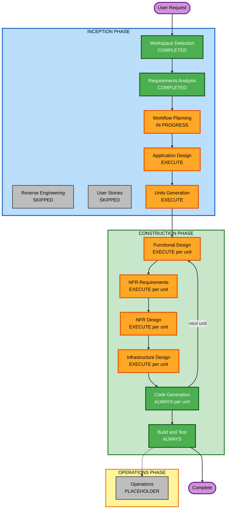

# Execution Plan
# Sabhyakriti — Saree eCommerce Website

---

## Detailed Analysis Summary

### Change Impact Assessment

| Impact Area | Assessment |
|---|---|
| **User-facing changes** | Yes — Complete new website with PLP, PDP, checkout, payments, account |
| **Structural changes** | Yes — Full system architecture from scratch (React + FastAPI + PostgreSQL + AWS) |
| **Data model changes** | Yes — New database schemas: Product, Category, User, Order, Payment, Review, Cart, Wishlist, Address |
| **API changes** | Yes — All new REST API endpoints (auth, products, cart, orders, payments, admin) |
| **NFR impact** | Yes — Full security baseline (15 rules), PBT enforcement, AWS infrastructure, performance targets |

### Risk Assessment

| Field | Value |
|---|---|
| **Risk Level** | High — New system with payment integration, multi-auth, full eCommerce lifecycle |
| **Rollback Complexity** | Moderate — Greenfield, no existing system to break. Each unit is independently testable |
| **Testing Complexity** | Complex — Payment gateway sandbox testing, OAuth integration, full order lifecycle, PBT |
| **Critical Dependencies** | Razorpay API keys, Google/Facebook OAuth credentials, AWS account, Twilio/SNS for OTP |

---

## Workflow Visualization

### Text Representation

```
INCEPTION PHASE
  [DONE] Workspace Detection
  [SKIP] Reverse Engineering (greenfield — no existing code)
  [DONE] Requirements Analysis
  [SKIP] User Stories (skipped by user decision)
  [NOW ] Workflow Planning
  [NEXT] Application Design
  [NEXT] Units Generation

CONSTRUCTION PHASE (Per-Unit Loop x 8 units)
  Each unit executes:
    [EXEC] Functional Design
    [EXEC] NFR Requirements
    [EXEC] NFR Design
    [EXEC] Infrastructure Design
    [EXEC] Code Generation (Planning + Generation)
  [EXEC] Build and Test (after all units)

OPERATIONS PHASE
  [HOLD] Operations (placeholder — future)
```

### Mermaid Diagram



---

## Phases to Execute

### INCEPTION PHASE

- [x] Workspace Detection — **COMPLETED**
- [x] Reverse Engineering — **SKIPPED** (greenfield project, no existing codebase)
- [x] Requirements Analysis — **COMPLETED**
- [x] User Stories — **SKIPPED** (user decision at requirements approval gate)
- [x] Workflow Planning — **IN PROGRESS**
- [ ] Application Design — **EXECUTE**
  - **Rationale**: Brand new system with 8+ components, service layer design required, component dependencies need definition before units can be decomposed
- [ ] Units Generation — **EXECUTE**
  - **Rationale**: Complex system spanning 8 units (auth, catalog, PDP, cart, orders, payments, admin, infrastructure) — decomposition needed for structured parallel development

### CONSTRUCTION PHASE (Per-Unit Loop — 8 Units)

For **each unit**, the following stages execute:

- [ ] Functional Design — **EXECUTE** (per unit)
  - **Rationale**: New data models and business logic for every unit (e.g., order lifecycle rules, payment webhook handling, discount engine)
- [ ] NFR Requirements — **EXECUTE** (per unit)
  - **Rationale**: Performance, security (all 15 rules), and scalability requirements apply to every unit; tech stack decisions per unit
- [ ] NFR Design — **EXECUTE** (per unit)
  - **Rationale**: NFR Requirements is executed, so NFR Design follows to incorporate patterns into each unit's design
- [ ] Infrastructure Design — **EXECUTE** (per unit)
  - **Rationale**: AWS services need mapping per unit (EC2, RDS, S3, CloudFront, SES, SNS, CloudWatch, IAM, VPC, ALB)
- [ ] Code Generation — **EXECUTE** (always, per unit)
  - **Rationale**: Implementation planning + code generation for all application and infrastructure code
- [ ] Build and Test — **EXECUTE** (always, after all units)
  - **Rationale**: Comprehensive build, unit test, integration test, PBT, and E2E test execution

### OPERATIONS PHASE

- [ ] Operations — **PLACEHOLDER** (future deployment and monitoring workflows)

---

## Proposed Development Units

| # | Unit Name | Contents | Key Dependencies |
|---|---|---|---|
| 1 | Foundation & Auth | DB schema, user registration/login, JWT, Google OAuth, Facebook OAuth, Phone OTP, password reset, email verification | None — first unit |
| 2 | Product Catalog & PLP | Product model, categories (Fabric/Occasion/Region), PLP with filters, search, sort, pagination | Unit 1 |
| 3 | Product Detail Page | PDP image gallery with maximize/lightbox, product attributes, care instructions, reviews, related products, stock display | Unit 2 |
| 4 | Cart & Wishlist | Cart CRUD, quantity management, cart persistence, wishlist management, coupon/discount engine | Units 1, 2 |
| 5 | Order Management | Checkout flow, order placement, full order lifecycle (place→confirm→ship→deliver), cancel/return/refund, email+SMS notifications, invoice PDF | Units 1, 2, 4 |
| 6 | Payment Integration | Razorpay (card/net banking/wallet), UPI, COD, payment webhook, refund API, payment receipt | Unit 5 |
| 7 | Admin Panel | Admin auth (MFA), dashboard, product/category/inventory CRUD, bulk CSV, order management, customer management, sales reports, coupon management | Units 1–6 |
| 8 | AWS Infrastructure | VPC, subnets, security groups, EC2 Auto Scaling, ALB, RDS PostgreSQL + read replica, S3 + CloudFront, SES, SNS, CloudWatch alarms, IAM roles, CI/CD pipeline | All units |

**Execution sequence**: Units 1 → 2 → 3 → 4 → 5 → 6 → 7 → 8 (sequential — each unit is fully designed and implemented before the next begins)

---

## Estimated Scope

| Metric | Estimate |
|---|---|
| **Total stages (across all units)** | 42 stages (5 per unit × 8 units + 2 always-execute + Inception stages) |
| **Primary goal** | Production-ready Saree eCommerce website with full checkout, payment, and admin |
| **Key deliverables** | React frontend, FastAPI backend, PostgreSQL schema, Admin Panel, Razorpay integration, AWS IaC (CDK/Terraform) |
| **Quality gates** | Requirements approved, design approved per unit, code reviewed, tests passing, security rules compliant per unit |

---

## Success Criteria

- Customer can browse, filter, and search sarees on PLP
- Customer can view full saree details with image zoom on PDP
- Customer can register/login via all 4 auth methods
- Customer can add to cart, apply coupons, and checkout
- Customer can pay via Razorpay, UPI, or COD
- Customer can track, cancel, and return orders
- Admin can manage full catalog, orders, inventory, and reports
- All 15 Security Baseline rules compliant
- Property-Based Tests passing for pricing, discounts, and order calculations
- Deployed and running on AWS
